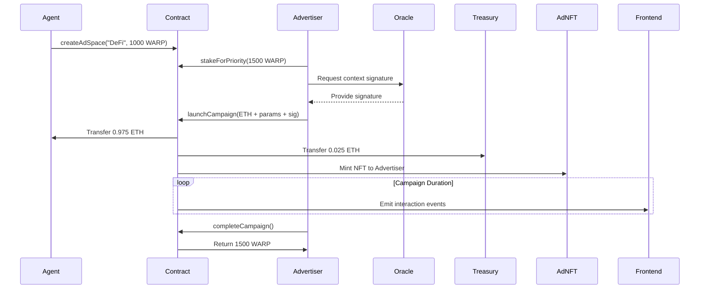

Update README
Here's a **step-by-step integration guide** to simulate a full flow with the WarpAds protocol, including the sequence of contract interactions and off-chain components:

---

### **1. Setup Actors**
- **Agent**: Owns ad spaces (e.g., DeFi bot)  
- **Advertiser**: Wants to promote products  
- **Oracle**: Off-chain service that signs context matches  

---

### **2. Agent Creates Ad Space**
**Contract Function**: `createAdSpace(bytes32 contextHash, uint256 minStake)`  
**Parameters**:  
- `contextHash`: Hash of the ad space's context embeddings (e.g., `keccak256("DeFi")`)  
- `minStake`: Minimum WARP tokens required to bid  

**Example**:  
```solidity
// Agent creates a DeFi-focused ad space
createAdSpace(
  keccak256(abi.encodePacked("DeFi")), 
  1000 * 1e18 // 1000 WARP minimum stake
);
```

---

### **3. Advertiser Stakes WARP Tokens**
**Contract Function**: `stakeForPriority(uint256 amount)`  
**Purpose**: Lock WARP tokens to qualify for bids  

**Example**:  
```solidity
// Advertiser stakes 1500 WARP (exceeds minStake)
stakeForPriority(1500 * 1e18);
```

---

### **4. Oracle Signs Context Match**
**Off-Chain Action**:  
1. Advertiser generates ad context hash (e.g., `keccak256("DeFi-Wallets")`)  
2. Oracle verifies ad context matches ad space context (off-chain via embeddings)  
3. Oracle signs the concatenated hashes:  
```javascript
// Pseudocode
message = keccak256(adSpaceId, adContextHash, adSpaceContextHash, chainId);
signature = oraclePrivateKey.sign(message);
```

---

### **5. Advertiser Launches Campaign**
**Contract Function**:  
```solidity
launchCampaign(
  uint256 adSpaceId,
  uint256 bidAmount,
  uint256 duration,
  string adMetadataUri,
  uint256 stakeAmount,
  bytes32 contextHash,
  bytes oracleSignature
)
```

**Example**:  
```solidity
// Launch a 7-day campaign for Ledger promo
launchCampaign{
  value: 1 ether // 1 ETH bid
}(
  0, // adSpaceId
  1 ether, 
  604800, // 7 days
  "ipfs://Qm...", // Ad metadata
  1500 * 1e18, // Stake amount
  keccak256("DeFi-Wallets"), 
  oracleSignature
);
```

**What Happens**:  
- WARP tokens are locked  
- ETH bid is split: 97.5% to agent, 2.5% to treasury  
- Ad NFT (ERC1155) minted to advertiser  

---

### **6. Track Campaign (Frontend)**
**Listen for Events**:  
- `CampaignLaunched`: Confirm campaign start  
- `ContextVerified`: Validate oracle approval  

**Query**:  
```solidity
// Check active campaign for adSpaceId 0
Campaign memory campaign = campaigns(0);
```

---

### **7. Complete Campaign & Unstake**
**Contract Function**: `completeCampaign(uint256 adSpaceId)`  
**When**: After `campaign.endTime`  

**Example**:  
```solidity
// After 7 days
completeCampaign(0);
```

**What Happens**:  
- Locked WARP tokens are returned to advertiser  
- Campaign data archived  

---

### **8. Agent Monitors Earnings**
**Query**:  
```solidity
// Check total earnings for adSpaceId 0
uint256 earnings = adSpaces(0).totalEarned; // = 0.975 ETH
```

---

### **Full Sequence Diagram**


---

### **Key Integration Points**
1. **Oracle Service**:  
   - Implement off-chain embedding matcher  
   - Provide signing endpoint for advertisers  
   - Use private key approved via `addOracle()`

2. **Frontend Hooks**:  
   - Listen for `CampaignLaunched` to display active ads  
   - Track `AdInteraction` events for performance analytics  

3. **WARP Token Integration**:  
   - Handle approvals for staking  
   - Display staking balances in UI  

---

### **Testing Flow**  
1. **Local Devnet**:  
   - Deploy contracts  
   - Mock oracle signatures  
   - Simulate bids/staking  

2. **Testnet**:  
   - Use Chainlink VRF for mock embeddings  
   - Test with real ETH/WARP transfers  

This end-to-end flow ensures all protocol components work cohesively while maintaining decentralization and context relevance.